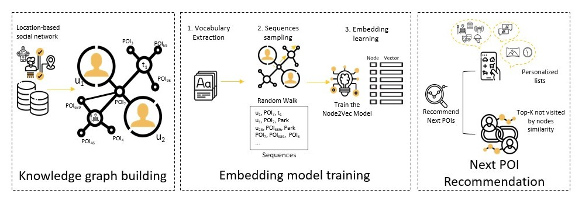

# SKGEM
### Paper: A Scalable Knowledge Graph Embedding Model for Next Point-of-Interest Recommendation in Tallinn City
#### Authors: Chahinez Ounoughi, Amira Mouakher, Muhammad Ibraheem Sherzad and Sadok Ben Yahia
doi: https://doi.org/10.1007/978-3-030-75018-3_29

#### Citaion

[Another Cell](@inproceedings{ounoughi2021scalable,
  title={A Scalable Knowledge Graph Embedding Model for Next Point-of-Interest Recommendation in Tallinn City},
  author={Ounoughi, Chahinez and Mouakher, Amira and Sherzad, Muhammad Ibraheem and Ben Yahia, Sadok},
  booktitle={International Conference on Research Challenges in Information Science},
  pages={435--451},
  year={2021},
  organization={Springer}
}

)
